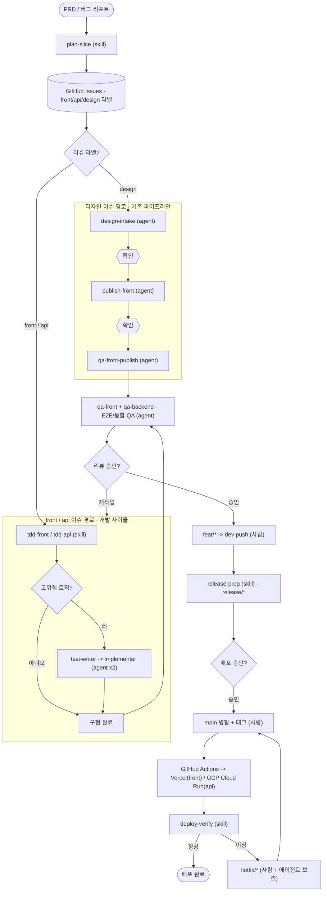
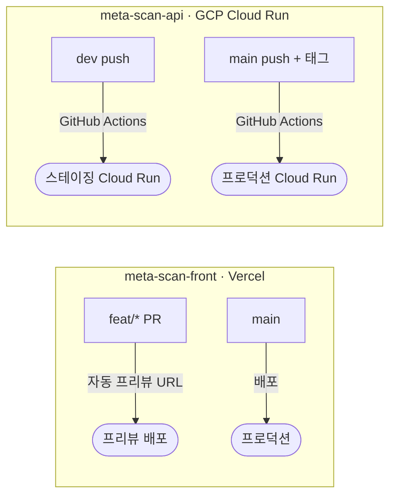

# 기획부터 배포까지 — 전체 개발 라이프사이클 하네스 (로드맵)

> **상태**: 2026-08-20 기준 제안/로드맵 문서입니다. 아직 구현되지 않았고, 아래 "열린 질문"이
> 정리되기 전까지는 ADR로 등록하지 않습니다. 시각화 버전은
> [Artifact](https://claude.ai/code/artifact/186423e0-f752-4c2b-9b07-23803dea53e2)로도 만들어봤지만,
> 소스 오브 트루스는 이 문서입니다.

## 배경

지금까지는 디자인 캔버스를 실제 코드로 옮기는 3단 파이프라인
(`design-intake → publish-front → qa-front-publish`, `.claude/agents/`,
`docs/case-study/git-branching-strategy.md`의 Git Flow)까지만 하네스로 구축돼 있었다. 여기에
① TDD 개발 사이클, ② 기획/이슈 슬라이스, ③ E2E/통합 QA, ④ Vercel/GCP CI/CD 배포까지
이어서, "이슈 발생 → 코드 → 테스트 → 배포"가 하나의 라이프사이클로 연결되게 만들고 싶다는
요청에서 이 문서를 정리했다. 기존 3단 파이프라인은 그대로 두고, 그걸 이 큰 구조 안의 한
계층(디자인 이슈 경로)으로 편입시키는 방향이다.

## 전체 흐름

이슈가 어떤 라벨을 다느냐에 따라 두 경로로 갈린다 — **디자인 이슈**는 이미 만들어둔 3단
파이프라인을 그대로 타고, **front/api 이슈**는 TDD 스킬을 기본 경로로 삼되 고위험 로직만
adversarial 2-agent로 격상한다. 두 경로 모두 하나의 E2E/통합 QA 게이트로 합류한 뒤, 사람
승인 → Git Flow 푸시 → 릴리즈 → CI/CD 순으로 내려간다.

도형 범례: **사각형** = 단계(스킬/에이전트), **마름모** = 분기 판단, **육각형** = 사람 확인
게이트, **원통** = 데이터 저장소, **스타디움** = 시작/종료.

## 계층별 상세

`기존`/`인프라`/`절차`는 이미 있거나 에이전트로 만들 대상이 아닌 것들이고, 나머지가 이번에
새로 설계할 대상이다.

| 계층 | 이름 | 형태 | 비고 |
|---|---|---|---|
| 0 · 기획/이슈 | `plan-slice` | skill | PRD/버그리포트를 슬라이스해 `gh issue create`. 지금 라벨엔 front/api/design/infra가 없어 라벨 세트부터 만들어야 함. |
| 1 · 디자인 이슈 | `design-intake → publish-front → qa-front-publish` | 기존 | 손 안 댐. `feat/*` + worktree 격리 규칙만 새로 얹음. |
| 1 · front/api 이슈 | `tdd-front` / `tdd-api` | skill | 기본 경로. Vitest(단위) 러너 구축이 선행 조건. |
| 1 · 고위험 로직 | test-writer → implementer | agent × 2 | 같은 컨텍스트가 테스트와 구현을 동시에 못 보게 격리 — red 상태를 구조적으로 강제. |
| 2 · E2E/통합 QA | `qa-front` / `qa-backend` | agent | Playwright(front) / supertest(api). 이름은 이미 예약해둠 — `qa-front-publish`(디자인 충실도)와 역할 분리. |
| 3 · Git Flow 푸시 | `feat/* → dev` | 절차 | 새 에이전트 없음 — 사람 승인 필수 구간. |
| 4 · 릴리즈 준비 | `release-prep` | skill | 버전 bump/체인지로그만. `main` 병합은 여전히 사람. |
| 5 · CI/CD 배포 | GitHub Actions | 인프라 | 에이전트 아닌 1회성 구축. Vercel(front) / GCP Cloud Run(api). |
| 6 · 배포 후 검증 | `deploy-verify` | skill | 실배포 URL에 스모크 테스트. 이상 감지 시 `hotfix/*`로 되먹임. |

## 열린 질문 (아직 결정 안 함)

### A. Vercel과 GCP는 배포 모델이 다르다

Vercel은 PR/브랜치마다 preview URL을 자동 생성해서, front만 놓고 보면 영구 스테이징
브랜치(`dev`)가 굳이 필요 없어질 수 있다. 반면 GCP Cloud Run은 그런 브랜치별 프리뷰가 기본
제공되지 않아 `dev` → staging Cloud Run 매핑이 여전히 필요하다 — front와 api가 서로 다른
배포 모델을 갖게 된다.

front는 PR 단위로 프리뷰가 공짜로 생기지만, api는 `dev` push를 명시적 트리거로 삼아야
스테이징이 갱신된다 — `docs/case-study/git-branching-strategy.md`의 릴리즈 트리거 미해결 항목과
맞물리는 지점이다.

### B. qa-backend가 진짜 Lighthouse를 매번 돌릴지

- **기본값 — 대부분 mock**: PR마다 도는 케이스는 외부 fetch/headless Chrome을 mock — 빠르고
  저렴, 회귀 탐지엔 충분.
- **비용 — 배포 전만 풀 스위트**: `main` 배포 직전에만 실제 Lighthouse/Puppeteer를 풀로
  실행 — 느리지만 실제 신호로 최종 확인.

매 PR마다 headless Chrome + Lighthouse 풀 실행은 느리고 비싸다. mock 비중과 "언제 풀로
돌릴지"는 `qa-backend`를 실제로 만들 때 정해야 한다.

## 시작 순서

전부 한 번에 만들지 않고 이 순서를 추천한다.

1. **테스트 러너 인프라** — Vitest(front/api) + Playwright + supertest. 이게 없으면 이후
   계층 전부 불가능.
2. **`plan-slice` + 라벨** — 가장 저비용, 지금 이슈 관리가 0인 상태라 바로 가치 있음.
3. **개발 사이클 스킬/에이전트** — `tdd-front/api`, `qa-front`, `qa-backend` 파일 작성.
4. **CI/CD** — 열린 질문 A(Vercel/GCP 배포 모델)부터 정하고 워크플로 작성 — 가장 마지막.
