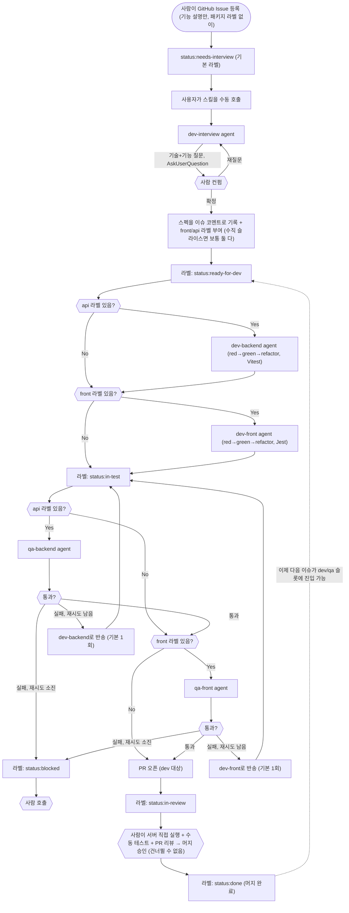

# 이슈 기반 TDD 개발 루프 — dev-interview → dev-backend/dev-front → qa-backend/qa-front 파이프라인

> **상태**: 2026-08-25 기준, 사용자와의 순차 인터뷰(AskUserQuestion)로 핵심 결정 사항을
> 확정했고 아래 "열린 질문" 6개가 전부 정리됐습니다 — ADR로 등록 가능한 상태입니다. 라벨
> (`status:*`/`front`/`api`/`priority:*`/`retry:used`)과 5개 agent 파일(`.claude/agents/
> dev-interview.md`, `dev-backend.md`, `dev-front.md`, `qa-backend.md`, `qa-front.md`), 오케스트
> 레이팅 스킬(`.claude/skills/tdd-issue-loop/SKILL.md`)까지 실제로 만들었습니다. **아직 실제
> 이슈로 시범 실행은 안 해봄** — 아래 "다음 단계" 4번 참고.
>
> **2026-08-31 수정**: 실제로 이슈 #2(pipe-connection) PR이 아직 머지되지 않은 상태에서 이슈
> #3(basic-seo-checklist)의 dev-backend가 이미 브랜치를 파고 커밋까지 들어간 사례가 발생함 —
> `feat/3-basic-seo-checklist`가 #2의 커밋을 포함하지 않는 지점(`95a5b5c`)에서 갈라져 있었음.
> 원래 정책("PR 오픈 시점에 다음 이슈의 dev/qa 큐가 넘어감")이 브랜치 발산·충돌을 실제로
> 만들어낸 것을 확인하고, 아래 "이슈 동시 처리"/"스킬 진입점"을 **"PR 머지" 기준으로 게이팅**
> 하도록 수정함(사용자 요청). 상세는 해당 절 참고.
>
> **이슈는 수직 슬라이싱(기능 단위)으로 쪼갭니다.** 하나의 이슈는 "프론트 이슈"/"백엔드 이슈"가
> 아니라 사용자에게 의미 있는 기능 하나(예: "AI Signals 카드가 실제 스캔 데이터를 pass/fail로
> 보여준다")이고, 그 수용 기준은 보통 백엔드(신호 추출·판정)와 프론트(렌더링·취합)를 함께
> 걸칩니다. 그래서 이 문서의 에이전트 파이프라인은 "프론트 아니면 백엔드"라는 배타적 분기가
> 아니라, **하나의 이슈 안에서 필요한 패키지 에이전트를 순서대로(백엔드 먼저) 거치는** 구조로
> 설계돼 있습니다 — 자세한 흐름은 아래 "전체 흐름" 참고. 순수 리팩터/인프라 이슈(예: `ScanService`
> God 클래스 분리처럼 한 패키지에만 국한된 작업)만 예외적으로 패키지 하나만 거칩니다.
>
> **`docs/case-study/dev-lifecycle-harness.md`와는 별개의 독립 문서입니다.** 그 로드맵도 GitHub
> Issues + `front`/`api`/`design` 라벨 + `tdd-front`/`tdd-api` 스킬을 제안하고 있어 이 문서와
> 상당히 겹치지만, 에이전트 구조가 다릅니다 — 그 문서는 "기본은 단일 스킬이 처리하고 고위험 로직만
> `test-writer → implementer` 2-agent로 격상"하는 안인 반면, 이 문서는 **모든 이슈에 대해
> `dev-interview` → (`dev-backend`, `dev-front` 필요한 쪽만 순서대로) → (`qa-backend`, `qa-front`
> 필요한 쪽만 순서대로) 파이프라인을 항상 거치는 안**입니다(2026-08-25 기준 5-agent, 추후
> `qa-e2e` 추가 시 6-agent — 아래 "에이전트별 역할" 참고). 두 문서를 언제 어떻게 합칠지는 정하지
> 않았습니다 — 아래 "열린 질문" 참고.

## 배경

`packages/meta-scan-front`/`meta-scan-api`를 실제 스캔 데이터로 연결하는 남은 작업(파이프 연결,
PRD 체크리스트 항목 확장 — 2026-08-24 대화에서 큰 틀로 리스트업함)을 순차적으로 처리하고 싶다는
요청에서 시작됨. 이슈 하나하나를 사람이 등록할 수 있어야 하고, 각 이슈마다 **기술/기능 인터뷰 →
TDD 개발 → 테스트 검증**을 거치는 루프를 스킬로 만들고 싶다는 것이 요청의 핵심. "루프"라는 표현을
썼지만 확인 결과 Claude Code의 `/loop`(대기·재시도 웨이크업) 메커니즘을 쓰겠다는 뜻은 아니었음 —
아래 "트리거" 절 참고. 2026-08-25 인터뷰에서 "이슈를 수직 슬라이싱해서 기능별로 TDD하겠다"는
전제가 추가로 확인되면서, 애초 구상했던 "프론트 에이전트 vs 백엔드 에이전트" 배타적 분리 설계를
"필요한 패키지 에이전트를 순서대로 다 거치는" 구조로 다시 조정함(아래 "전체 흐름" 참고).

## 확정된 결정 사항 (2026-08-24 ~ 2026-08-25 인터뷰)

| 항목 | 결정 | 비고 |
|---|---|---|
| 이슈 저장소 | **GitHub Issues** | 사람이 웹 UI로 직접 등록 가능해야 한다는 요구가 결정적. `gh` CLI로 스킬이 읽고 라벨을 갱신. |
| 에이전트 구성 | **5개(추후 6개 예정) — `dev-interview` / `dev-front` / `dev-backend` / `qa-front` / `qa-backend` (+ 예정: `qa-e2e`)** | 처음엔 기존 `design-intake → publish-front → qa-front-publish` 3단 패턴을 본떠 `interview`/`dev`/`test` 3-agent로 설계했으나, 2026-08-25 인터뷰에서 패키지별 전담 agent로 세분화하는 쪽으로 재결정됨. 이전 세션에서 "미래의 기능/UX 회귀 TDD QA 에이전트"용으로 비워뒀던 `qa-front`/`qa-backend` 예약 슬롯을 여기서 실제로 씀(2026-08-25 확인 — 예약해뒀던 이름 그대로 `qa-backend`가 맞고, `dev` 쪽도 대칭으로 `dev-backend`라는 이름을 씀). `qa-e2e`는 이후 추가될 예정(기능/UX 회귀 테스트 등, 지금 범위 아님). |
| 분리 vs 통합 | **하이브리드** — 에이전트 파일은 패키지별로 분리(토큰/컨텍스트 절약), 크로스 패키지(수직 슬라이스) 이슈는 오케스트레이팅 스킬이 필요한 에이전트를 순서대로 순차 호출(이슈를 쪼개지 않음) | 완전 분리는 수직 슬라이싱과 충돌(거의 모든 기능 이슈를 쪼개야 함), 완전 통합은 컨텍스트만 무거워지고 실익이 적음(Jest/Vitest가 이미 패키지별로 갈려 있어 red-green 사이클 자체는 통합해도 어차피 패키지별로 따로 돎). 공통 흐름(브랜치/PR/재시도 규칙)은 오케스트레이팅 스킬이 담당해 에이전트 파일 간 중복을 줄임. |
| 크로스 패키지 실행 순서 | **백엔드 먼저 — `dev-backend`/`qa-backend` → `dev-front`/`qa-front`** | 프론트가 API 응답 형태에 의존하므로, 백엔드 계약이 먼저 확정돼야 프론트 TDD가 현실적인 테스트/목(mock)을 짤 수 있음. |
| 패키지 라벨 부여 주체 | **`dev-interview`가 인터뷰 후 직접 부여** | 사람은 이슈 등록 시 `front`/`api` 라벨을 몰라도 됨 — 기능이 뭔지만 적으면, `dev-interview`가 기술 스코프를 논의하며 라벨(수직 슬라이스면 보통 `front`+`api` 둘 다, 순수 리팩터/인프라면 하나만)을 확정해 붙임. |
| 이슈 상태 표현 | **라벨로 상태 머신** (`status:*`) | GitHub 네이티브 기능만으로 충분, `gh issue list --label` 필터링으로 조회. |
| 인터뷰 산출물 | **이슈 코멘트에 축적** | 별도 스펙 파일 없음 — 이슈 자체가 논의+결론을 다 담음. |
| 단계별 컨펌 게이트 | **인터뷰 단계만 사람 컨펌 필수, 개발→테스트는 자동 진행** | 기존 design→publish→qa 파이프라인(매 단계 컨펌)보다 느슨함 — 스펙만 확정되면 dev/qa는 사람 개입 없이 PR까지 감(단, 재시도가 소진되면 예외 — 아래 "실패 시 재처리 정책" 참고). |
| 실패 시 재처리 정책 | **제한 재시도 후 blocked** | `qa-backend`/`qa-front`가 테스트/lint/typecheck 실패를 발견하면 대응하는 `dev-backend`/`dev-front`에게 자동으로 돌려보내 재시도(기본 1회, 필요시 조정 가능) — Puppeteer/chrome-launcher처럼 무거운 리소스를 계속 돌리는 무한 루프를 막으면서도 사소한 실수는 자동 복구. 재시도 후에도 실패하면 `status:blocked`로 바꾸고 사람 호출. |
| 패키지 라벨 공유 | **공유 — `docs/harness/dev-lifecycle-harness.md`와 동일한 `front`/`api` 라벨 재사용**(`pkg:` 접두사 없음) | `dev-lifecycle-harness.md`가 이미 `front`/`api`/`design`/`infra` 라벨을 제안해뒀음(아직 저장소엔 없음, 두 문서 모두 생성 필요). 이 문서는 그중 `front`/`api`만 씀(`design`/`infra`는 이 파이프라인 범위 밖). |
| 이슈 우선순위 | **`priority:high`/`priority:medium`/`priority:low` 라벨 우선, 없으면 이슈 번호(FIFO)** | 우선순위 라벨이 붙은 이슈를 먼저 처리, 동일 우선순위 내에서는(또는 라벨이 아예 없는 이슈끼리는) 번호(=생성) 순. |
| Git/커밋/PR 정책 | **이슈별 브랜치 생성, PR 오픈까지 자동, PR 머지(→ `dev` push)는 항상 사람 — 머지 전 사람이 반드시 서버를 직접 실행해 수동으로 확인** | 저장소 규칙(승인 없는 commit/push 금지)에 "PR까지는 자동 허용"이라는 예외를 명시적으로 추가하는 것. 브랜치는 저장소의 `feat/*` Git Flow 컨벤션(`docs/case-study/git-branching-strategy.md`)을 따름. PR은 그 이슈의 마지막 qa 단계(보통 `qa-front`, 백엔드만 있는 이슈면 `qa-backend`)가 오픈. 자동 qa(Jest/Vitest+lint+typecheck)는 회귀만 잡을 뿐 실제 화면/동작 확인이 아니므로, **PR 오픈 후 머지 승인 전에 사람이 `pnpm dev:front`/`dev:api`로 서버를 띄워 직접 테스트하는 걸 건너뛸 수 없는 필수 단계로 둠**(2026-08-31 추가). 스킬/에이전트는 어떤 경우에도 자동으로 머지하지 않고, 매번 명시적으로 사람에게 머지 여부를 확인받음. |
| 이슈 간 dev/qa 진입 조건 | **이전 이슈의 PR이 "머지 완료"일 것 — "PR 오픈"만으론 부족** | 2026-08-31 수정. 원래는 "PR 오픈 = 그 이슈가 dev/qa 큐에서 빠짐 = 다음 이슈가 곧바로 진입" 이었는데, 이러면 아직 `dev`에 안 들어간 이전 이슈의 변경분을 다음 이슈의 브랜치가 반영하지 못한 채 갈라져 나가 충돌 위험이 쌓임(이슈 #3에서 실제 발생). 그래서 **한 번의 스킬 호출에서 dev/qa 자동 구간은 최대 한 이슈만 PR 오픈까지 진행**하고, 그 PR이 머지될 때까지 다음 이슈의 dev/qa는 시작하지 않음(사람이 머지한 뒤 스킬을 다시 호출하면 그때 다음 이슈로 진입). 인터뷰 큐는 이 제약과 무관하게 계속 앞서갈 수 있음(코드/브랜치를 안 건드리므로). |
| 트리거 | **`/loop` 스킬 사용 안 함** — 사용자가 매번 명시적으로 스킬을 1회성 호출 | cron/webhook 같은 무인 폴링 인프라를 만들지 않음. 스킬 호출 시점에 대기 중인 이슈 백로그를 처리. |
| 이슈 동시 처리 | **interview만 파이프라이닝, dev/qa 자동 구간은 이슈당 항상 1개씩만 + 이전 이슈 PR 머지 전엔 다음 이슈 진입 안 함** | 이슈 A가 dev/qa 자동 구간(사람 개입 없음)을 도는 동안, 이슈 B의 interview(사람 자원 필요)는 곧바로 시작해 사람을 기다리게 하지 않음. 한 이슈 안에서 `dev-backend`→`dev-front`는 애초에 순차 설계(위 "크로스 패키지 실행 순서" 참고)라 동시 실행 이슈가 없음. **다른 이슈**끼리의 dev/qa 상한은 1개(전역)이고, worktree 격리 인프라(`isolation: "worktree"`)가 없는 것과 `meta-scan-api` 테스트가 Puppeteer/chrome-launcher를 띄우는 것도 동시 실행을 피하는 이유. 여기에 더해(2026-08-31, 위 "이슈 간 dev/qa 진입 조건" 행 참고) **다음 이슈가 이 슬롯에 들어가려면 이전 이슈의 PR이 머지까지 완료돼야 함** — 슬롯이 "비었다"는 게 "PR 오픈"이 아니라 "머지 완료"를 뜻하도록 기준을 올림. |
| 테스트 러너 | **결정됨 (2026-08-24) — `meta-scan-front`는 Jest, `meta-scan-api`는 Vitest** | `docs/case-study/test-runner-survey.md` 참고. 리소스/마찰 관점에서는 "두 패키지 다 Vitest"가 더 효율적이라고 추천했었지만, 프로젝트가 학습을 겸하고 있어 프론트/백엔드에서 서로 다른 러너를 각각 경험해보는 쪽을 의도적으로 선택함 — `dev-lifecycle-harness.md`의 "Vitest(front/api 둘 다)" 제안과는 다른 방향으로 확정됨. `dev-front`/`qa-front`는 `pnpm --filter meta-scan-front test`(Jest), `dev-backend`/`qa-backend`는 `pnpm --filter meta-scan-api test`(Vitest)를 씀. |

## 전체 흐름

도형 범례: **사각형** = 단계(agent/스킬), **마름모** = 분기 판단, **육각형** = 사람 확인 게이트,
**스타디움** = 시작/종료, **원통** = 미해결 지점. `api`/`front` 라벨이 둘 다 있는(수직 슬라이스)
이슈는 `dev-backend`→`dev-front`, `qa-backend`→`qa-front` 순으로 전부 거치고, 하나만 있는
(순수 리팩터/인프라) 이슈는 해당하는 쪽만 거칩니다. 맨 아래 점선 화살표(`DONE -.-> L1`)가
2026-08-31에 추가된 크로스 이슈 게이트입니다 — 이 이슈가 실제로 머지(`status:done`)돼야
dev/qa 자동 구간 슬롯이 비워져 대기 중인 다음 이슈가 들어갈 수 있습니다. PR이 열린 것만으로는
(`status:in-review`) 다음 이슈가 진입하지 않습니다.

## 에이전트별 역할

| 에이전트 | 입력 | 하는 일 | 출력 | 사람 개입 |
|---|---|---|---|---|
| **dev-interview** | 이슈 제목/본문 | 기술 관점(아키텍처/영향 범위/기존 패턴과의 정합성)과 기능 관점(사용자 시나리오/수용 기준) 질문을 `AskUserQuestion`으로 순차 진행, 스펙 확정 시 `front`/`api` 패키지 라벨을 직접 부여 | 이슈 코멘트에 합의된 스펙(수용 기준 포함) + 패키지 라벨 | **필수** — 스펙 확정 전 진행 불가 |
| **dev-backend** | 확정된 스펙(이슈 코멘트), `api` 라벨이 있을 때만 호출 | `feat/*` 브랜치 생성(또는 기존 브랜치에 이어서) → 수용 기준 기반 실패 테스트 작성(red, Vitest) → 구현(green) → 리팩터 → 커밋. 대상: `packages/meta-scan-api`. `front` 라벨도 있으면 이 단계가 먼저 실행됨(위 "크로스 패키지 실행 순서") | 브랜치 + 커밋 | 없음 (자동 진행) |
| **dev-front** | 확정된 스펙(이슈 코멘트), `front` 라벨이 있을 때만 호출 | 위와 동일하되 대상: `packages/meta-scan-front`(테스트는 Jest). `api` 라벨도 있으면 `dev-backend` 완료 후 실행 | 브랜치 + 커밋 | 없음 (자동 진행) |
| **qa-backend** | `dev-backend`가 만든 커밋, `api` 라벨이 있을 때만 호출 | `pnpm --filter meta-scan-api test`(Vitest) + lint/typecheck 실행, 실패 시 `dev-backend`로 반송(최대 1회). `front` 라벨이 없으면 통과 시 바로 PR 오픈, 있으면 `qa-front`로 넘김 | PR 또는 반송 또는 `qa-front`로 인계 | 없음 (자동 진행) — 재시도 소진 시 `status:blocked`로 사람 호출 |
| **qa-front** | `dev-front`가 만든 커밋(+ 있다면 `qa-backend` 통과 결과), `front` 라벨이 있을 때만 호출 | `pnpm --filter meta-scan-front test`(Jest) + lint/typecheck 실행, 실패 시 `dev-front`로 반송(최대 1회), 통과하면 PR 오픈 | PR 또는 반송 | 없음 (자동 진행) — 재시도 소진 시 `status:blocked`로 사람 호출 |
| **qa-e2e** *(예정, 아직 안 만듦)* | — | 기능/UX 회귀 테스트 — 지금 이 파이프라인 범위 밖 | — | 미정 |

## 라벨 체계 (제안 — 저장소에 아직 없음)

`gh label list` 확인 결과 현재 저장소엔 GitHub 기본 라벨만 있고 `status:*` 계열은 없음. 스킬을
만들 때 아래 라벨을 먼저 생성해야 함:

- `status:needs-interview` — 이슈 생성 시 기본값 (또는 라벨 없음 = 이 상태로 취급)
- `status:interviewing` — `dev-interview` 진행 중 (동시 처리 방지용)
- `status:ready-for-dev` — 스펙 확정 + 패키지 라벨 부여 완료, dev 단계 대기
- `status:in-dev` — `dev-backend`/`dev-front` 진행 중
- `status:in-test` — `qa-backend`/`qa-front` 진행 중
- `status:in-review` — PR 오픈, 사람 리뷰 대기
- `status:done` — PR 머지 완료
- `status:blocked` — 재시도 소진 등 어느 단계에서든 막힌 경우

패키지 구분 라벨은 `docs/harness/dev-lifecycle-harness.md`와 공유하는 `front`/`api`(위 "확정된
결정 사항" 표 참고). **사람이 이슈 생성 시 미리 붙이는 게 아니라, `dev-interview`가 인터뷰를 마친
뒤 스코프에 맞게 직접 붙임** — 수직 슬라이스 이슈는 보통 `front`+`api` 둘 다, 순수 리팩터/인프라
이슈만 하나만 붙음. 우선순위 라벨 `priority:high`/`priority:medium`/`priority:low`도 함께 생성.

## 스킬 진입점

`/loop`을 쓰지 않기로 했으므로, 사용자가 스킬을 호출할 때마다:

1. `status:needs-interview`/`status:ready-for-dev` 라벨이 붙은 열린 이슈를 조회, `priority:*`
   라벨이 있으면 우선(같은 우선순위 또는 라벨 없는 이슈끼리는 이슈 번호순)
2. **interview 단계는 완전 순차** — 사람이 실시간으로 응답해야 하는 자원이므로 `dev-interview`는
   한 번에 이슈 하나씩만 진행. 스펙이 확정되면 `dev-interview`가 그 자리에서 `front`/`api`
   라벨을 직접 부여
3. 어떤 이슈가 `status:ready-for-dev`가 되면, **그 이슈의 dev→qa 자동 구간을 백그라운드로
   넘기고 곧바로 다음 이슈의 interview를 시작**(파이프라이닝) — 사람을 기다리게 하지 않는 게
   목적. 단, 이건 **interview 큐**에만 해당 — dev/qa 큐 진입은 아래 4번 조건을 따로 봄.
4. **dev→qa 자동 구간은 한 번의 스킬 호출에서 최대 한 이슈까지만 PR 오픈으로 진행하고,
   그 PR이 머지될 때까지 다음 이슈는 진입하지 않음**(2026-08-31 수정, 위 "확정된 결정 사항"
   표의 "이슈 간 dev/qa 진입 조건" 행 참고 — 이전엔 "PR 오픈"만으로 슬롯이 빈다고 봐서,
   머지 안 된 이전 이슈의 변경분을 반영 못한 채 다음 이슈 브랜치가 갈라지는 문제가 실제로
   발생함). 여러 이슈가 동시에 `status:ready-for-dev`여도 dev/qa 큐는 맨 앞 이슈 하나만
   처리하고, 그 이슈가 `status:in-review`(PR 오픈)에 도달하면 **이번 스킬 호출에서는 다음
   이슈로 넘어가지 않고 멈춤** — 대기 중인 나머지 이슈들은 사람이 그 PR을 머지한 뒤 스킬을
   다시 호출할 때 처리됨. 한 이슈 안에서는 라벨(`api`/`front`)에 따라 `dev-backend`(있으면
   먼저) → `dev-front`(있으면) → `qa-backend`(있으면) → `qa-front`(있으면) 순으로 필요한
   에이전트만 순차 호출. `dev-interview`는 이 게이팅과 무관하게 계속 다음 이슈로 넘어감
5. `qa-backend`/`qa-front`가 실패를 발견하면 대응하는 `dev-backend`/`dev-front`로 반송(기본
   1회) — 재시도 후에도 실패하면 `status:blocked`로 바꾸고 스킬 호출 종료 시 사람에게 보고
6. 한 이슈가 `status:in-review`(PR 오픈)에 도달하면 그 이슈는 이 스킬 호출의 dev/qa 처리
   대상에서 빠지고, 위 4번대로 dev/qa 큐 전체가 이번 호출에서는 거기서 멈춤. PR 머지는 항상
   사람이 직접 승인하며(서버를 실제로 띄워 수동 테스트한 뒤), 스킬/에이전트가 대신 머지하는
   경우는 없음
7. 대기 중인 이슈(interview 필요/ready-for-dev 큐)가 더 없고 진행 중인 dev/qa도 없으면 스킬
   종료, 사람이 다시 호출하기 전까지 대기

즉 "루프"라는 단어가 가리키는 건 한 번의 스킬 호출 안에서 **interview는 순차로 계속 앞서
나가되, dev/qa 자동 구간은 사람이 이전 PR을 머지하기 전까지 다음 이슈로 넘어가지 않는
파이프라이닝**(interview가 사람을 기다리게 하지 않는 게 목적이지, 머지 없이 dev/qa
처리량을 늘리는 게 목적은 아님)을 뜻함 — 세션 간 자동 재시작(`/loop` 웨이크업)은 여전히 안 씀.

## 열린 질문 (아직 결정 안 함)

1. ~~테스트 러너 선택~~ — 2026-08-24 결정 완료(위 표 참고). `docs/case-study/test-runner-survey.md`.
2. ~~test agent가 실패를 발견했을 때 처리~~ — 2026-08-25 결정 완료(위 표 참고): 제한 재시도(기본
   1회) 후 `status:blocked`.
3. ~~패키지 라벨을 `dev-lifecycle-harness.md`와 공유할지~~ — 2026-08-25 결정 완료(위 표 참고):
   공유(`front`/`api` 라벨 재사용).
4. ~~에이전트 이름과 기존 예약 슬롯의 관계~~ — 2026-08-25 결정 완료: 3-agent(interview/dev/test)
   설계를 5-agent(`dev-interview`/`dev-front`/`dev-backend`/`qa-front`/`qa-backend`, 추후
   `qa-e2e` 추가 시 6-agent)로 재설계, 예약해뒀던 `qa-front`/`qa-backend` 슬롯 이름을 그대로
   실사용(대칭으로 `dev` 쪽도 `dev-front`/`dev-backend`로 명명). **추가로 2026-08-25 후속
   인터뷰에서**: 수직 슬라이싱 전제 하에 "완전 분리 vs 완전 통합" 재검토 → **하이브리드**로 확정
   (패키지별 에이전트 분리 유지 + 크로스 패키지 이슈는 오케스트레이팅 스킬이 순차 호출),
   실행 순서는 백엔드 먼저, 패키지 라벨은 `dev-interview`가 직접 부여.
5. ~~이슈 간 동시성 상한~~ — 2026-08-25 결정 완료: **전역 1개 유지**(패키지별로 나누지 않음).
   한 이슈 안에서 `dev-backend`→`dev-front` 순서는 이미 순차라 문제 없고, **서로 다른 이슈**
   사이도 worktree 격리 인프라가 없는 한(단일 워킹 디렉토리에서 서로 다른 브랜치 동시 체크아웃
   불가) 패키지가 달라도 동시 실행하지 않음. worktree 인프라를 나중에 추가하면 재검토.
6. ~~이슈 우선순위~~ — 2026-08-25 결정 완료(위 표 참고): `priority:*` 라벨 우선, 없으면 FIFO.

## 다음 단계

1. ~~라벨 생성~~ — 완료 (`status:*` 8개, `front`/`api`, `priority:high/medium/low`, 재시도 추적용
   `retry:used`).
2. ~~5개 agent 파일 작성~~ — 완료 (`.claude/agents/dev-interview.md`, `dev-backend.md`,
   `dev-front.md`, `qa-backend.md`, `qa-front.md`). 두 dev agent 모두 Jest/Vitest가 아직 실제
   설치 전이라는 걸 알고 있고, 필요하면 첫 실행에서 devDependency·config를 직접 부트스트랩하도록
   써둠(ADR-012는 결정만 됐지 실제 도입은 안 됐던 상태 — 이 문서 상단 참고).
3. ~~오케스트레이팅 스킬 작성~~ — 완료 (`.claude/skills/tdd-issue-loop/SKILL.md`). 인터뷰 큐(순차,
   매번 게이트)와 dev/qa 큐(이슈당 1개, 게이트 없음)를 분리해서 처리하고, 라벨 기반으로 필요한
   에이전트만 순서대로(백엔드 먼저) 호출하도록 구현.
4. **아직 안 함 — 테스트 대상 첫 이슈 하나(수직 슬라이스면 front+api 둘 다 걸리는 것으로)로 전체
   흐름 시범 실행**, 특히 다음을 실전에서 확인: Jest/Vitest 부트스트랩이 실제로 잘 도는지,
   `retry:used` 라벨 기반 재시도 추적이 의도대로 동작하는지, PR이 올바른 브랜치/제목/본문으로
   열리는지. 열린 질문 5번(이슈 간 동시성)도 worktree 인프라를 실제로 추가하게 되면 재검토.
